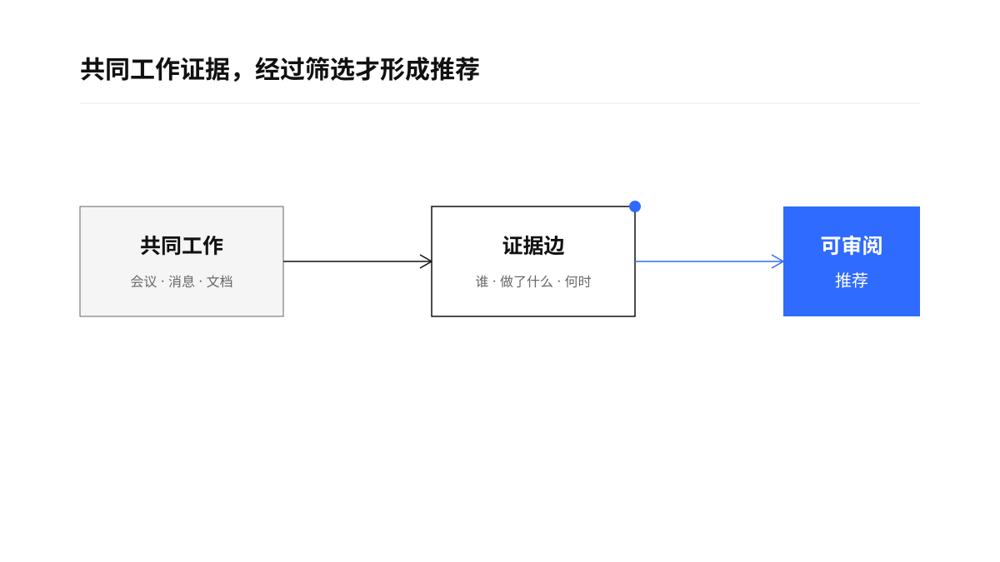
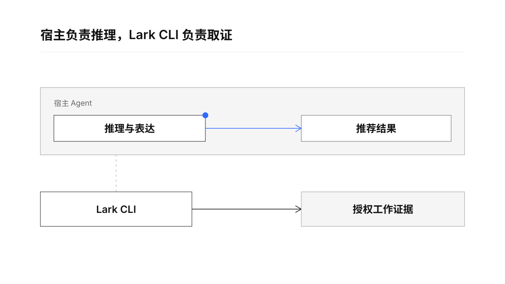
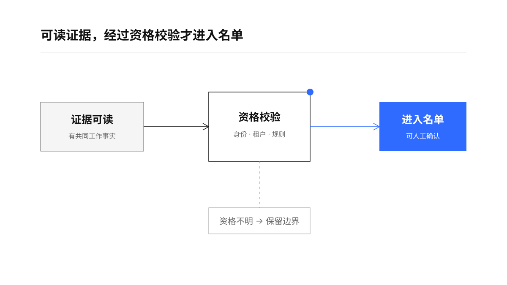

> “The purpose of computing is insight, not numbers.” — Richard Hamming ([source](https://mathshistory.st-andrews.ac.uk/Biographies/Hamming/quotations/))

# 绩效环评人推荐

Performance Reviewer Recommendation

一个面向豆包企业版、Codex 和 Claude Code 的飞书 / Lark 360 环评人推荐 Skill：从授权的共同工作证据中筛选候选人，按推荐度排序，并说明每个人为什么适合提供反馈。

最快的使用方式：把这个 Skill 安装到宿主 Agent，然后提出“给我推荐 10 位 360 环评人”。宿主负责理解和表达，飞书 / Lark 负责提供可核验的工作证据。

## 它解决什么问题

环评人选择的难点在于“谁真的观察过这名员工的工作”。本 Skill 将共同交付、关键决策、任务跟进、会议逐字稿、文档协作和消息上下文组织成证据边，再输出一份需要人工确认的候选名单。

<p align="center">
  
</p>

推荐结果会区分证据强度、角色视角、数据缺口和资格限制。会议标题、参会记录、消息数量和单纯被 @ 不会单独证明一个人适合做环评人。

## 工作逻辑

核心边界是：Lark CLI 取证，宿主 Agent 推理，Skill 约束候选规则和输出格式。

<p align="center">
  
</p>

1. 解析员工、观察周期、推荐人数和角色视角。
2. 验证当前 Lark 用户身份、租户和授权状态。
3. 分页读取共同会议、逐字稿、消息、任务、文档和其他授权来源。
4. 只保留能说明共同工作事实的证据边，排除只参会、只被提及或证据不足的人。
5. 按工作相关性、观察深度、时效、证据广度、视角互补和反馈可靠性排序。
6. 输出人类可读名单；需要机器处理时输出并校验 JSON。

## 宿主与数据访问

- 豆包企业版：使用内置飞书能力或企业批准的 Lark CLI 桥接。
- Codex / Claude Code：需要本地安装并完成授权的 `lark-cli`；缺少时提示安装或启用，停止读取。
- 本 Skill 不绑定模型，也不写死模型名。模型选择由宿主 Agent 自己负责。
- 不读取或伪造原始绩效系统结果；不能访问的来源会明确标注边界。

<p align="center">
  
</p>

## 快速开始

```text
使用 performance-reviewer-recommendation，给我推荐本周期 10 位 360 环评人，按推荐度从高到低排序，并说明每个人的共同工作证据和限制。
```

默认推荐 10 位。用户明确给出人数时，以用户人数为准。推荐结果始终是草稿，包含 `human_review_required: true`，不会自动提交环评或写回绩效系统。

## 脱敏案例

[`examples/redacted-run.md`](examples/redacted-run.md) 展示了一次真实使用路径的脱敏版本。姓名、组织、客户、项目、链接、时间、ID 和精确数量均已替换或泛化，只保留 Skill 的工作逻辑、证据边界和输出结构。

## 文件结构

```text
SKILL.md                         Skill 主规则
agents/openai.yaml               宿主展示信息
references/                      数据源、宿主、证据和输出契约
scripts/                         输出校验脚本
tests/fixtures/                  脱敏测试夹具
examples/redacted-run.md         脱敏案例
assets/boards/                   README 语义画板
assets/scene/                    画板的结构化 Scene JSON
```

## 校验

```bash
python3 /path/to/skill-creator/scripts/quick_validate.py .
python3 scripts/validate_output.py tests/fixtures/valid-result.json
python3 scripts/validate_output.py tests/fixtures/invalid-no-human-review.json
```

当前仓库包含结构校验、JSON 输出校验和脱敏测试夹具。它提供推荐草稿，不替代组织的绩效政策、资格规则或人工确认。
